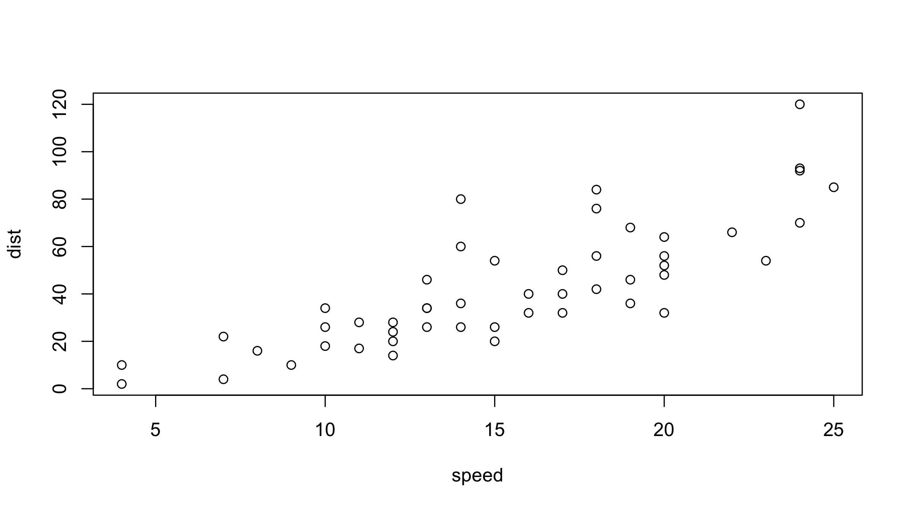
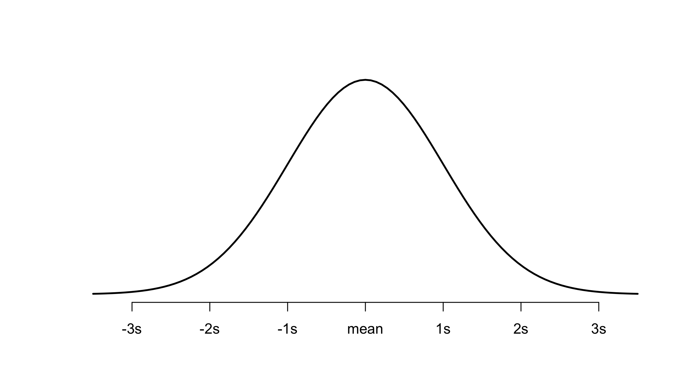
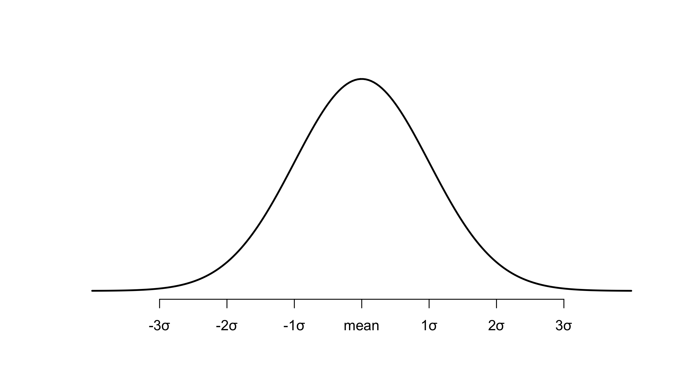
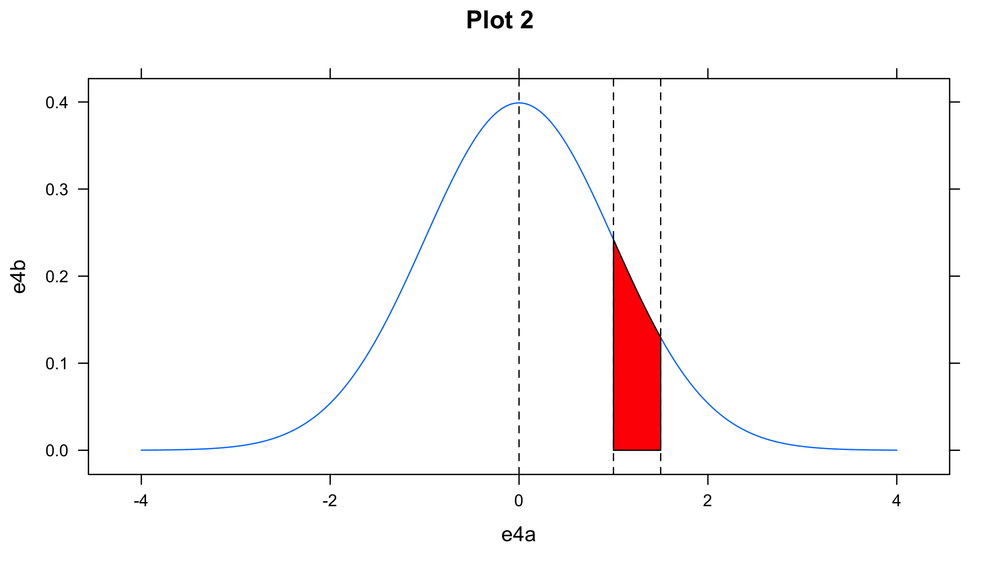
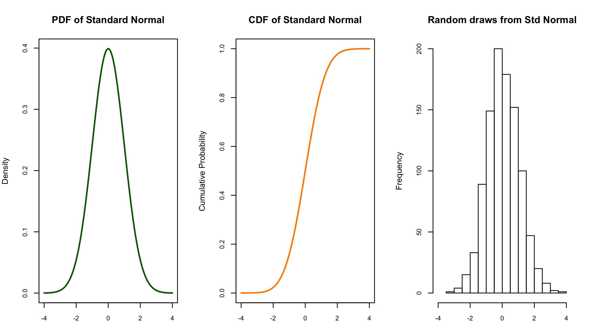

Lecture1. Experimental Design
========================================================
author: Klimov
date: 01.03.17
autosize: true
css: rpres.css
#width: 1920
#height: 1080


Sample size detection
========================================================

Pragmatic considerations: 1) the availability of participants and 2) limited of resources.

Nielsen and Landauer suggest:
- Usability testing with a single participant will find about a third of the usability problems (30%)
- Little to be gained from testing with more than five (?)

Certainly, if the intention is to run a controlled experiment and perform statistical analysis on the results, at least twice this number is recommended.

Variables
========================================================

Experiments manipulate and measure variables under controlled conditions, in order to test the hypothesis.

There are two main types of variable:
- IV - those that are ‘manipulated’ or changed (known as the independent variables)
- DV - those that are measured (the dependent variables).

independent variables -> dependent variables

IV - interface style, level of help, number of menu items and icon design

DV - time taken to complete a task, the number of errors made, user preference and the quality of the user’s performance

Independent Variables (1)
========================================================
left: 70%

## Definition

IV - interface style, level of help, number of menu items and icon design

IV - typicaly caterigical

IV has different values; each value that is used in an experiment is known as a *level* of the variable

***

## Example

IV - treatment
- IV level 0 — no medicine
- IV level 1 — cheap medicine
- IV level 2 — ...

DV - ?

Independent Variables (2)
========================================================

Complex experiments may have more than one independent variable.

Permutation (multiplying) of levels of every IV makes experimental condition

Example
----
DV - speed of the user’s response

#IV1 - number of menu items, but also IV2 - choice of commands used on the menu.

```
In this case we have ... independent variables. 
```

If there were two sets of command names (that is, two levels), we would require six experimental conditions to investigate all the possibilities (three levels of menu size × two levels of command names).

Experimental design
===
#incremental: true
type: sub-header

- Between-subjects

  Also called *randomized*
  
  There are at least two conditions: *the experimental condition* (in which the variable has been manipulated) and the *control*, which is identical to the experimental condition except for this manipulation
  
  ```
  In this case we have ... independent variables. 
  ```

- Within-subjects

  Also called *repeated measures*
  
- Mixed design 
  
Statistical measures
===
- *Discrete* variables or *continuous* variables

  We can convert continuous varible to discrete (reduce power)
  
- Tests can be *paramentic* and *non-parametric*
  
  If data non aligned well we can: 1) check *outliers*, 2) make *log-transformation*, 3) move to more robust tests
  
  ```
  What tests are more powerfull? 
  ```
  
Statistical tests
===
|Independent variable|Dependent variable||
|---|---|---|
|**Parametric**, IV is normaly distributed|
|Two valued|Normal|Student’s t test on difference of means
|Discrete|Normal|ANOVA (ANalysis Of VAriance)
|Continuous|Normal|Linear (or non-linear) regression factor analysis
|**Non-parametric**, IV is non-normaly distributed||
|Two valued|Continuous|Wilcoxon (or Mann–Whitney) rank-sum test
|Discrete|Continuous|Rank-sum versions of ANOVA
|Continuous|Continuous|Spearman’s rank correlation
|**Contingency tests**, IV is aggregated||
|Two valued|Discrete|No special test, see next entry
|Discrete|Discrete|Contingency table and chi-squared test
|Continuous|Discrete|(Rare) Group independent variable and then as above

How to present the result?
===
- **Is there a difference?**

  For example, is one system better than another? Techniques that address this are called hypothesis testing. The answers to this question are not simply yes/no, but of the form: ‘we are 99% certain that selection from menus of five items is faster than that from menus of seven items’.
  Statistical tests below.
  
- **How big is the difference?**
  For example, ‘selection from five items is 260 ms faster than from seven items’. This is called point estimation, often obtained by averages.

  Universal measure is *D-Cohen* coefficient

- **How accurate is the estimate?**
  For example, ‘selection is faster by 260 ± 30 ms’. Statistical answers to this are in the form of either measures of variation such as the *standard deviation* of the estimate, or *confidence intervals*. Again, the answers one obtains are probabilistic: ‘we are 95% certain that the difference in response time is between 230 and 290 ms’.

Working exercise
========================================================
Design an experiment to test whether adding color coding to an interface will improve accuracy. Identify your: hypothesis, participant group, dependent and independent variables, experimental design, task and analysis approach.

**Participants**: Participants are ...

**Hypothesis**: Color coding will ...

**IV (Independent Variable)**: ...

**DV (Dependent Variable)**: ...

**Design**: ...

**Task**: ... (Experimental scheme, what user should?)

**Analysis**: What statistical test will fit?

Working exercise - answer
===
Design an experiment to test whether adding color coding to an interface will improve accuracy. Identify your: hypothesis, participant group, dependent and independent variables, experimental design, task and analysis approach.

**Participants**: Taken from user population.

**Hypothesis**: Color coding will make selection more accurate.

**IV (Independent Variable)**: Color coding.

**DV (Dependent Variable)**: Accuracy measured as number of errors.

**Design**: Between-groups to ensure no transfer of learning (or within-groups with appropriate safeguards if participants are scarce).

**Task**: The interfaces are identical in each of the conditions, except that, in the second, color is added to indicate related menu items. Participants are presented with a screen of menu choices (ordered randomly) and verbally told what they have to select. Selection must be done within a strict time limit when the screen clears. Failure to select the correct item is deemed an error. Each presentation places items in new positions. Participants perform in one of the two conditions.

**Analysis**: t-test.

Slide With Plot
========================================================
class: center-img smaller


========================================================
class: center-img smaller



Normal distribution
========================================================


========================================================


```
[1] 2.309748
```

===



R packages
===
Stored mostly in **CRAN**, but some fresh library stored in github.

What? Cran is The **C**omprehensive **R** **A**rchive **N**etwork

Can be usen inside the interpreter!

Example:
```
install.packages("pwr")
```

Top 20 Packages (avaliable on Cran)
===

|Package|Downloads|
|---|---|
|Rcpp|693288|
|ggplot2|598484|
|stringr|543434|
|plyr|523220|
|digest|521344|
|reshape2|483065|
|colorspace|476304|
|RColorBrewer|453858|
|manipulate|395232|
|scales|394389|

***

|Package|Downloads|
|---|---|
|labeling|373374|
|proto|369096|
|munsell|368949|
|gtable|364015|
|dichromat|362562|
|mime|352780|
|RCurl|340530|
|bitops|322743|
|zoo|302052|
|knitr|295528|

Prompt Slide
====================================
type: prompt


```
processing file: lec2.Rpres
Quitting from lines 300-322 (lec2.Rpres) 
Ошибка в library(ggplot2) :there is no package called 'ggplot2'
Вызовы: knit ... withCallingHandlers -> withVisible -> eval -> eval -> library
Выполнение остановлено
```
