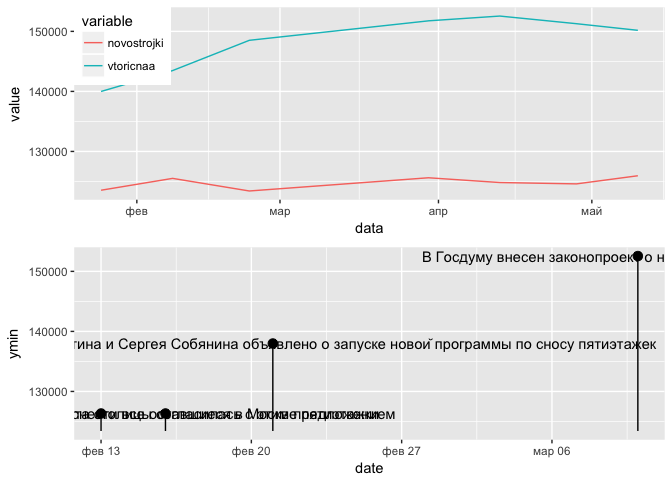
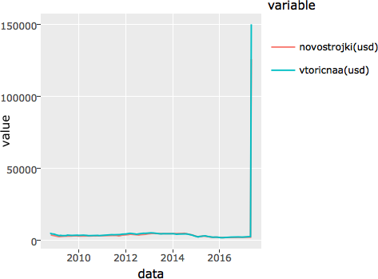

Lab5. Рынок недвижимости в Москве
================
Alexey Klimov
07 июня, 2017

-   [Текст задания доступен [по ссылке](https://docs.google.com/document/d/1J6iW5QnxXUECdo7fKcBOLXqgdiRpFc_fKhKM5uAmClk)](#----)
-   [Загрузка нужных пакетов и хорошие настройки](#-----)
-   [Служебные функции](#-)
-   [Загрузка данных](#-)
    -   [Считываем данные из таблиц](#---)
-   [Дальше нет ничего интересного](#---)

Текст задания доступен [по ссылке](https://docs.google.com/document/d/1J6iW5QnxXUECdo7fKcBOLXqgdiRpFc_fKhKM5uAmClk)
===================================================================================================================

Загрузка нужных пакетов и хорошие настройки
===========================================

``` r
options(scipen = 10, digits = 2, OutDec = '.')
knitr::opts_chunk$set(
  cache = TRUE
  , echo = FALSE
  , autodep = TRUE
  , encoding = "UTF-8"
  , dpi = 96
  , global.par = TRUE
  , par = TRUE
  , crop = TRUE
  , comment = NA
  )
```

    Loading tidyverse: ggplot2
    Loading tidyverse: tibble
    Loading tidyverse: tidyr
    Loading tidyverse: readr
    Loading tidyverse: purrr
    Loading tidyverse: dplyr

    Conflicts with tidy packages ----------------------------------------------

    filter(): dplyr, stats
    lag():    dplyr, stats

Служебные функции
=================

-   `save_url` - для сохранения страниц с обработкой javascript
-   `write` - для сохранения файлов с одновременным созданием необходимых поддиректорий
-   `apply_function_to_column`, `apply_function_to_column` - применение функции к колонке и нескольким колонкам (аналог apply)
-   `remove_whitespace`

Загрузка данных
===============

Берем данные с restate.ru (исходный код страниц для Москвы и Санкт-Петербурга сохранен в папке `data/raw_html`).

Считываем данные из таблиц
--------------------------

Здесь нам поможет пакет `rvest` и его функции `html_node`, `html_table`. Подсказка - исходная таблица находится в css-селекторе — "div.chart table".

Затем данные и даже сами имена переменных нужно отчистить (например, начиная с такого `names(data) %>% stri_trans_tolower %>%   stri_trans_general("latin") %>% stri_trans_general("latin-ascii") %>% iconv(to = 'ASCII//TRANSLIT')`)

Дальше нет ничего интересного
=============================

<table style="width:62%;">
<colgroup>
<col width="8%" />
<col width="9%" />
<col width="8%" />
<col width="11%" />
<col width="8%" />
<col width="8%" />
<col width="8%" />
</colgroup>
<thead>
<tr class="header">
<th align="center">Mon</th>
<th align="center">Tues</th>
<th align="center">Wed</th>
<th align="center">Thurs</th>
<th align="center">Fri</th>
<th align="center">Sat</th>
<th align="center">Sun</th>
</tr>
</thead>
<tbody>
<tr class="odd">
<td align="center">8</td>
<td align="center">74</td>
<td align="center">67</td>
<td align="center">17</td>
<td align="center">6</td>
<td align="center">0</td>
<td align="center">0</td>
</tr>
</tbody>
</table>

<table style="width:97%;">
<colgroup>
<col width="9%" />
<col width="9%" />
<col width="9%" />
<col width="9%" />
<col width="9%" />
<col width="9%" />
<col width="9%" />
<col width="9%" />
<col width="9%" />
<col width="9%" />
</colgroup>
<thead>
<tr class="header">
<th align="center">2008</th>
<th align="center">2009</th>
<th align="center">2010</th>
<th align="center">2011</th>
<th align="center">2012</th>
<th align="center">2013</th>
<th align="center">2014</th>
<th align="center">2015</th>
<th align="center">2016</th>
<th align="center">2017</th>
</tr>
</thead>
<tbody>
<tr class="odd">
<td align="center">7</td>
<td align="center">25</td>
<td align="center">24</td>
<td align="center">21</td>
<td align="center">18</td>
<td align="center">11</td>
<td align="center">12</td>
<td align="center">23</td>
<td align="center">24</td>
<td align="center">7</td>
</tr>
</tbody>
</table>

<https://realty.rbc.ru/news/577d16e89a7947e548ea49f3>

-   Change point analysis <https://stats.stackexchange.com/questions/60245/penalty-value-in-changepoint-analysis/60440>

-   Granger causality interpretation using R <https://stats.stackexchange.com/questions/131261/granger-causality-interpretation-using-r>

<!-- -->


    Attaching package: 'reshape2'

    The following object is masked from 'package:tidyr':

        smiths

    Warning: attributes are not identical across measure variables; they will
    be dropped

    Warning: attributes are not identical across measure variables; they will
    be dropped

    No trace type specified:
      Based on info supplied, a 'scatter' trace seems appropriate.
      Read more about this trace type -> https://plot.ly/r/reference/#scatter

    Warning in RColorBrewer::brewer.pal(N, "Set2"): minimal value for n is 3, returning requested palette with 3 different levels


    Attaching package: 'plotly'

    The following object is masked from 'package:ggplot2':

        last_plot

    The following object is masked from 'package:stats':

        filter

    The following object is masked from 'package:graphics':

        layout

    Warning: attributes are not identical across measure variables; they will
    be dropped

    No trace type specified:
      Based on info supplied, a 'scatter' trace seems appropriate.
      Read more about this trace type -> https://plot.ly/r/reference/#scatter

    Warning in RColorBrewer::brewer.pal(N, "Set2"): minimal value for n is 3, returning requested palette with 3 different levels


    We recommend that you use the dev version of ggplot2 with `ggplotly()`
    Install it with: `devtools::install_github('hadley/ggplot2')`


    Attaching package: 'forecast'

    The following object is masked from 'package:ggfortify':

        gglagplot


    Attaching package: 'zoo'

    The following objects are masked from 'package:base':

        as.Date, as.Date.numeric

    Warning in zoo(realty_data, order.by = as.Date(as.character(realty_data
    $data))): some methods for "zoo" objects do not work if the index entries
    in 'order.by' are not unique

Five types of outliers can be considered.

By default:

-   "AO" additive outliers,
-   "LS" level shifts,
-   "TC" temporary changes are selected;

Manualy you can add:

"IO" innovative outliers and "SLS" seasonal level shifts can also be selected

Futher info is here: <https://jalobe.com/blog/tsoutliers/>

    Warning in zoo(realty_data$novostrojki, order.by = realty_data$data): some
    methods for "zoo" objects do not work if the index entries in 'order.by'
    are not unique


    Attaching package: 'xts'

    The following objects are masked from 'package:dplyr':

        first, last


    Using ',' as decimal and '.' as grouping mark. Use read_delim() for more control.

    Parsed with column specification:
    cols(
      date = col_number(),
      description = col_character(),
      weigth = col_integer()
    )


    Attaching package: 'gridExtra'

    The following object is masked from 'package:dplyr':

        combine



    We recommend that you use the dev version of ggplot2 with `ggplotly()`
    Install it with: `devtools::install_github('hadley/ggplot2')`


