Lab3 - Icon types
========================================================
author: Klimov, Titova
date: 
autosize: true

Task1
===

***
Imagine you are designing a new interface to a document-processing package, which is to use icons for presentation. You are considering two styles of icon design and you wish to know which design will be easier for users to remember. One set of icons uses naturalistic images (based on a paper document metaphor), the other uses abstract images (see Figure). How might you design an experiment to help you decide which style to use? [Dix et al., 2005]

Reading dataframe
========================================================

Dataframe originated from Alan Dix HCI 9.2 table.


```r
data <- read.csv2("data1_icons.csv", header=TRUE)
data
```

```
   Participant_number Presentation_order Natural Abstract
1                   1                A_N     656      702
2                   2                A_N     259      339
3                   3                A_N     612      658
4                   4                A_N     609      645
5                   5                A_N    1049     1129
6                   6                N_A    1135     1179
7                   7                N_A     542      604
8                   8                N_A     495      551
9                   9                N_A     905      893
10                 10                N_A     715      803
11                 11                N_A     666        -
```

Today we need imports
====

```r
library(dplyr)
library(sjPlot)
```


Structure cleanup
===

```r
str(data)
```

```
'data.frame':	11 obs. of  4 variables:
 $ Participant_number: int  1 2 3 4 5 6 7 8 9 10 ...
 $ Presentation_order: Factor w/ 2 levels "A_N","N_A": 1 1 1 1 1 2 2 2 2 2 ...
 $ Natural           : int  656 259 612 609 1049 1135 542 495 905 715 ...
 $ Abstract          : Factor w/ 11 levels "-","1129","1179",..: 9 4 8 7 2 3 6 5 11 10 ...
```

Cleanup. Step 1
===

```r
data_clean <- data %>% dplyr::filter(Abstract != "-")
str(data_clean)
```

```
'data.frame':	10 obs. of  4 variables:
 $ Participant_number: int  1 2 3 4 5 6 7 8 9 10
 $ Presentation_order: Factor w/ 2 levels "A_N","N_A": 1 1 1 1 1 2 2 2 2 2
 $ Natural           : int  656 259 612 609 1049 1135 542 495 905 715
 $ Abstract          : Factor w/ 11 levels "-","1129","1179",..: 9 4 8 7 2 3 6 5 11 10
```

```r
data_clean <- data_clean %>% mutate(Abstract=as.numeric(as.character(data_clean$Abstract)))
data <- data_clean
```

Summary
===

```r
summary(data)
```

```
 Participant_number Presentation_order    Natural          Abstract     
 Min.   : 1.00      A_N:5              Min.   : 259.0   Min.   : 339.0  
 1st Qu.: 3.25      N_A:5              1st Qu.: 558.8   1st Qu.: 614.2  
 Median : 5.50                         Median : 634.0   Median : 680.0  
 Mean   : 5.50                         Mean   : 697.7   Mean   : 750.3  
 3rd Qu.: 7.75                         3rd Qu.: 857.5   3rd Qu.: 870.5  
 Max.   :10.00                         Max.   :1135.0   Max.   :1179.0  
```

Prepare data
===

```r
library(tidyverse)
#data %>% separate(Presentation_order, c("first", "second"), sep = "_", remove=FALSE)
data <- data %>% rowwise() %>% mutate(Participant_mean=mean(c(Natural, Abstract), na.rm=T))
data <- data %>% mutate(Natural_diff=Natural - Participant_mean)
data <- data %>% mutate(Abstract_diff=Abstract - Participant_mean)
```


Melting data (converting to long format)

```r
data_melt <- reshape2::melt(data = data, id.vars=c("Participant_number","Presentation_order"), value.name = "time", variable.name="icon_type")
data_melt_diff <- data_melt %>% filter(icon_type == "Natural_diff" | icon_type == "Abstract_diff")
data_melt_abs <- data_melt %>% filter(icon_type == "Natural" | icon_type == "Abstract")
```


===

T-test
===

```r
t.test(data$Natural, data$Abstract)
```


```r
# TODO - split slides

lm_model_abs <- lm(time ~ icon_type * Presentation_order, data = data_melt_abs)
lm_model_abs2 <- lm(time ~ icon_type + Presentation_order * Participant_number, data = data_melt_abs)

lm_model_diff <- lm(time ~ icon_type * Presentation_order, data = data_melt_diff)
sjp.lm(lm_model_abs, show.summary = TRUE)
```


```r
sjp.lm(lm_model_diff, show.summary = TRUE)
```

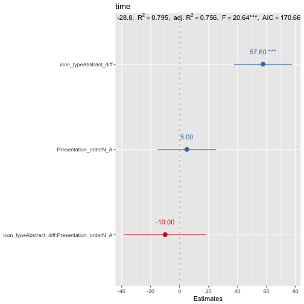

```r
lmer_abs <- lme4::lmer(time ~ icon_type * Presentation_order + (1 | Participant_number), data = data_melt_abs)
#lmer_abs2 <- lme4::lmer(time ~ icon_type + Presentation_order + (0 | Participant_number), data = data_melt_abs)
lmer_abs2 <- lme4::lmer(time ~ icon_type * Presentation_order + (1 | Participant_number), data = data_melt_abs)

sjp.lmer(lmer_abs2, sort.coef = "(Intercept)")
```


```r
sjp.lmer(lmer_abs)
```


```r
sjp.lmer(lmer_abs, type = "fe")
```

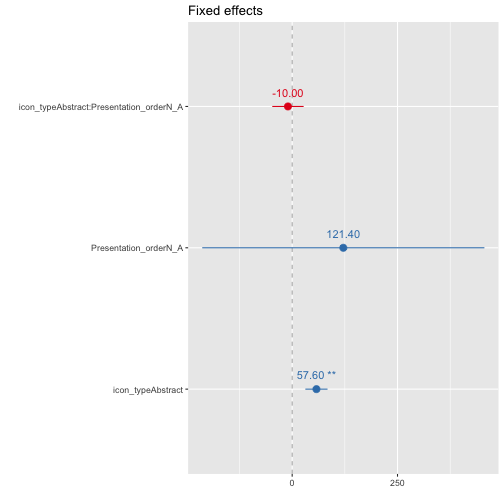

```r
sjp.lmer(lmer_abs, type = "fe.slope")
```

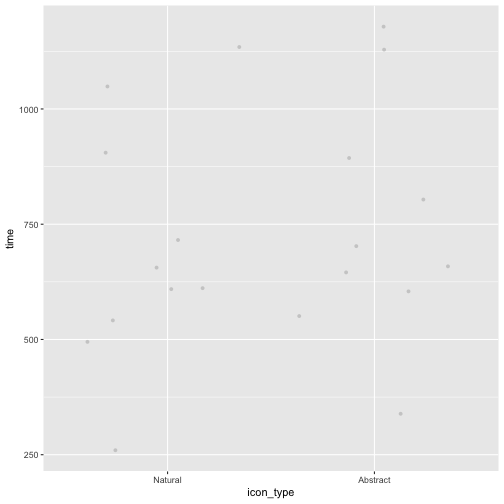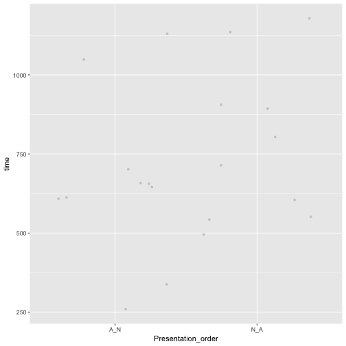

```r
sjp.lmer(lmer_abs, type = "pred.fe", vars="icon_type")
```

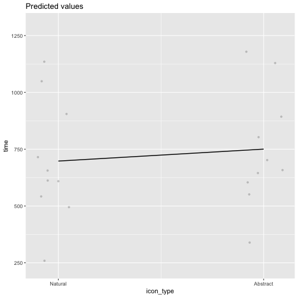

```r
sjp.lmer(lmer_abs2, type = "pred", vars="icon_type")
```

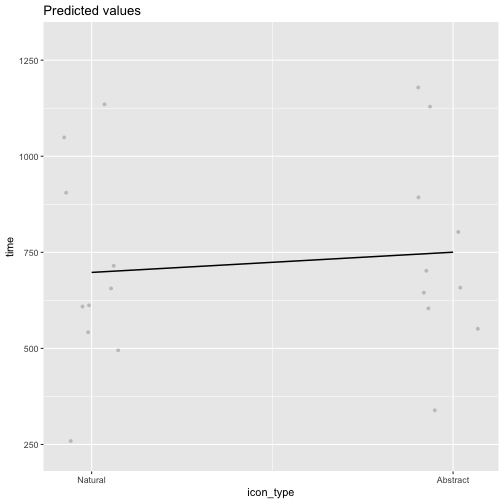

```r
sjp.lmer(lmer_abs2, type = "pred", vars="Presentation_order")
```


```r
sjp.int(lmer_abs2, type = "eff")
```

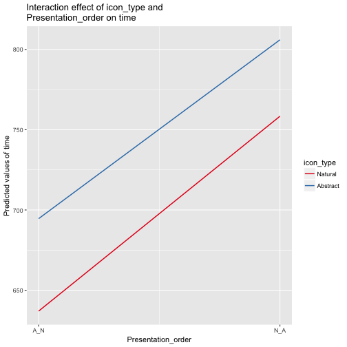

```r
sjp.int(update(lmer_abs2, data=data_melt_diff), type = "eff")
```

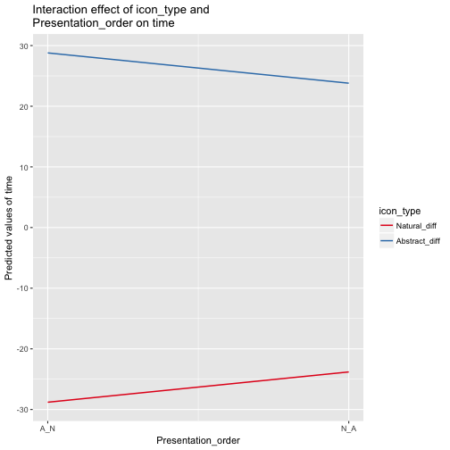

===


```r
model1 <- aov(time ~ (icon_type + Presentation_order) + Error(Participant_number), data=data_melt_diff)
summary(model1)
```

```

Error: Participant_number
                   Df    Sum Sq   Mean Sq
Presentation_order  1 5.049e-29 5.049e-29

Error: Within
                   Df Sum Sq Mean Sq F value   Pr(>F)    
icon_type           1  13834   13834   59.31 9.06e-07 ***
Presentation_order  1      0       0    0.00        1    
Residuals          16   3732     233                     
---
Signif. codes:  0 '***' 0.001 '**' 0.01 '*' 0.05 '.' 0.1 ' ' 1
```

```r
sjp.aov1(var.grp = data_melt_diff$icon_type, var.dep = data_melt_diff$time)
```

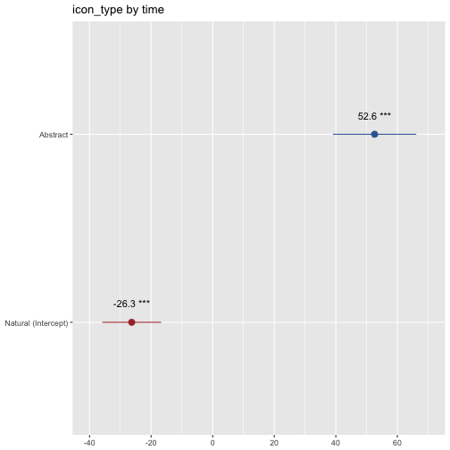

```r
sjp.aov1(var.grp = data_melt_diff$icon_type, var.dep = data_melt_diff$time, meansums = TRUE, show.summary = TRUE)
```

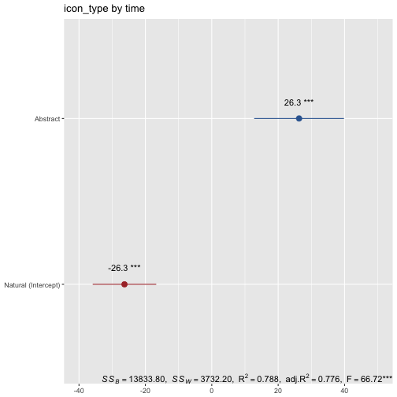

===
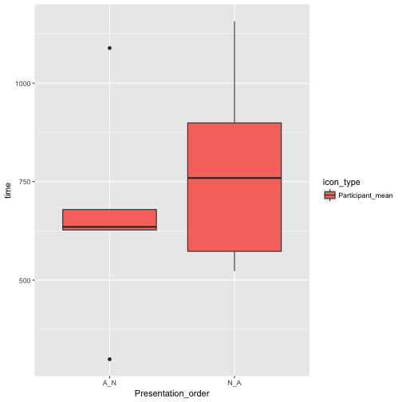

***

```r
library(ggplot2)
p <- ggplot(data_melt, aes(Presentation_order, time))
p + geom_boxplot(aes(fill = icon_type))
```

How this correlate with real world data?
===


References
===

[1] A. Dix, et al *Human Computer Interaction 3rd Ed.*, Prentice Hall, 2005

