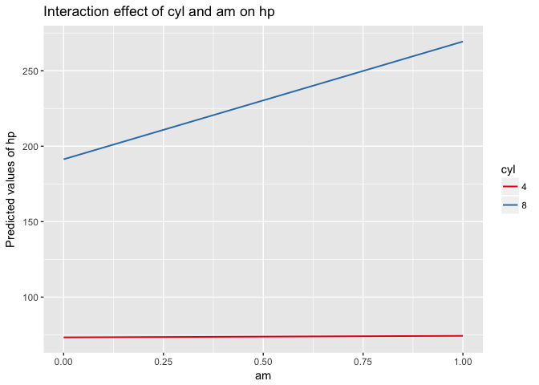

Описание результатов
================
Alexey Klimov
19 05 2017

``` r
summary(cars)
```

    ##      speed           dist    
    ##  Min.   : 4.0   Min.   :  2  
    ##  1st Qu.:12.0   1st Qu.: 26  
    ##  Median :15.0   Median : 36  
    ##  Mean   :15.4   Mean   : 43  
    ##  3rd Qu.:19.0   3rd Qu.: 56  
    ##  Max.   :25.0   Max.   :120

Как грамотно описать результаты вывода статистических пакетов
=============================================================

Для корреляций
--------------

``` r
cor1 <- cor.test(cars$speed, cars$dist)
```

*При росте одной переменной вторая тоже увеличивается*

С ростом стокрости значимо увеличивается пройденное расстояние (*r*<sub>*П**и**р**с**о**н**а*</sub> = 0.81, *p* = 0, *N* = 50)

Проверка различий в двух групах (T-test Стьюдента)
--------------------------------------------------

*Значение числовой переменной в друх группах отличается*

Будем сравнивать 4 и 8 цилиндровые машины. В первую группу попадут машины где 4 цилидра, во вторую — где 8.

``` r
cars4_8 <- mtcars %>% filter(cyl == 4 | cyl == 8) %>% mutate(cyl=factor(cyl))
A <- cars4_8 %>% filter(cyl == 4)
B <- cars4_8 %>% filter(cyl == 8)
t_test1 <- t.test(A$hp, B$hp)
```

В результате сравнения мощности двигателя между группами машин c 4 цилиндрами (*m**e**a**n* = 82.64, *N* = 11) и группой с 8 цилиндрами (*m**e**a**n* = 209.21, *N* = 14) с показало значимые различия *t*(2, 18.1)= − 8.43, *p* = 0. Мощность машин с 8 цилиндрами была выше 209.21 л.с. против 82.64 л.с.

LM
--

*Выходная перменная зависит от одного или нескольких предикторов*

``` r
lm1 <- lm(hp ~ cyl * am, data = mtcars)
```

``` r
lm1
```

Call: lm(formula = hp ~ cyl \* am, data = mtcars)

Coefficients: (Intercept) cyl am cyl:am
-44.7 29.5 -75.9 19.2

Из вывода линейной модели нужно привести: **R*<sup>2</sup>, *N*, *p* − *v**a**l**u**e*, F-статистику*

Для каждого регрессора (предиктора) желательно привести *β* − *к**о**э**ф**ф**и**ц**и**е**н**т**а* либо t-значние либо *S**E* + значимость

Нагляднее всего график:

``` r
library("sjPlot")
sjPlot::sjp.int(lm1)
```


