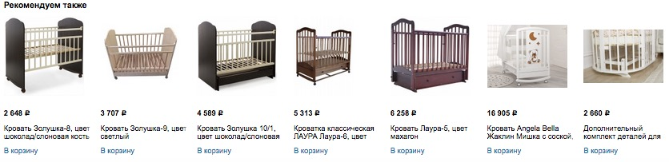
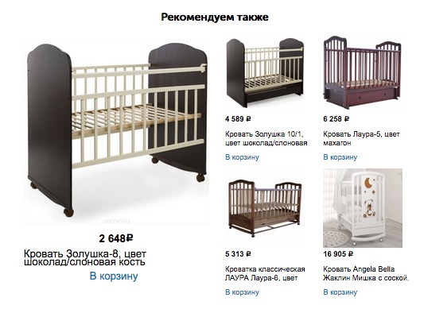

# Improving Ozon.ru design

Project was made by:

* Nikita Marinosyan
* Nikita Panin
* Maria Savina

## Project description

When a user buys a particular item there is a chance he might want to buy something else connected with his current purchase. To help him understand what he wants Ozon.ru has special Suggestions pane​. It presents several connected items and allows user quickly add them to the cart.

The problem is that users are getting confused when they see so many options to pick from. The goal is to to improve efficiency of ​Suggestions pane​. We highlighted one suggested item to attract users.

## Content

This project includes:
* :blue_book: report.pdf,
* :bookmark_tabs: dataset.csv,
* :computer: script.xlsx
* :sunrise_over_mountains: presentation.pdf

## Results
Our experiment demonstrated that highlighting one of the items in *suggestions pane* increases 
the number ​of suggested items that had been added to cart​.